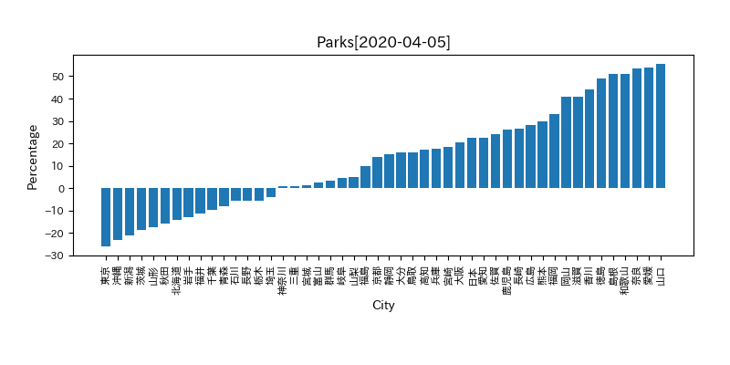
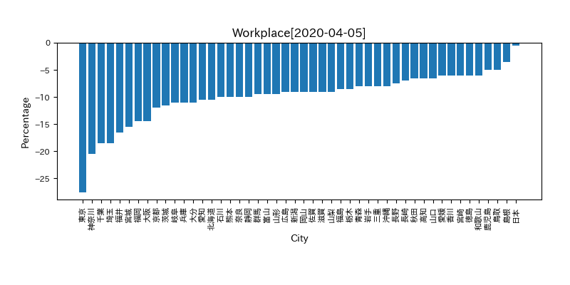

# COVID-19 Google Mobility Ranking in Japan
Google が提供する [COVID-19 Community Mobility Reports](https://www.google.com/covid19/mobility/) から国内都道府県の数値をソートしてグラフ生成を自動化します。
元データはPDFで提供しているため、Kyle Mcdonaldによる[covid-mobility-data](https://github.com/kylemcdonald/covid-mobility-data) から自動抽出されたデータを利用しています。
OCR処理があるため、提示されている数値に誤りが含まれている可能性があります。その点に関しては [covid-mobility-data](https://github.com/kylemcdonald/covid-mobility-data) のAccuracy をご参照ください。
 
# Result
下記項目に応じて平時からの増加減少率を％表示で各都道府県ごとに順位ごとにグラフ化します。実行結果はそれぞれ
  * result_image/: 各グラフ画像
  * tsvs/: 各項目ごとの都道府県データ

に保存されます。なおtsvデータには最新の日付以外の過去の日付における増減率も含まれていますので、日付ごとの増加をグラフ化したい場合はこちらをご利用ください。

## 各項目ごとのグラフ（2020年4月5日データ）

* retail & recreation: 小売、レクレーション
* Grocery & pharmacy：食料品・薬局
* parks：公園
* transit stations：乗換駅
* workplace：仕事場
* Residential：住宅







# Requirement
* python(>3.6)
* matplotlib
  
# Usage
国内全体のtsvファイルは[covid-mobility-data](https://github.com/kylemcdonald/covid-mobility-data)の手順に従って生成してください。生成したファイル名を
  2020-03-29_JP_Mobility_Report_en.pdf.tsv
とした場合で説明します。生成したファイルが最新のもので日付が異なる場合はcompare.pyのスクリプトを修正してください。

```bash
git clone https://github.com/TetsuakiBaba/COVID-19-Google-Mobility-Ranking-in-Japan
cd COVID-19-Google-Mobility-Ranking-in-Japan
cp <somewhere>/2020-03-29_JP_Mobility_Report_en.pdf.tsv ./
python compare.py
```
 
# Note
先に記述したとおりですが、OCR処理によりデータ欠損等が含まれる場合がありますので、その点を十分に理解した上でご利用ください。
 
